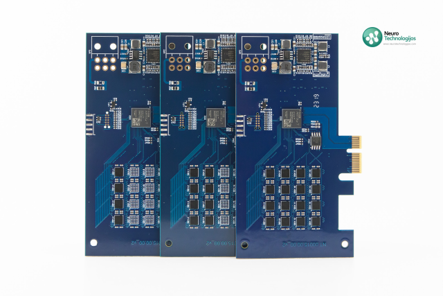

## NT Adaptive PCIe card library

NT Adaptive PCIe neural boards can recognize static and video images, sounds, various electrical signals, text, data.
Neuromorphic memory NT Adaptive PCIe series control boards have no microcontroller and can be mounted in any PC or other
device with a PCIe connector. NT Adaptive PCIe boards come in three versions - with 4, 8 or 16 neural chips.
Signal recognition process in neuromorphic chips takes place at the hardware level and makes huge acceleration for central processor.

to see details https://www.neurotechnologijos.com/en/nt-adaptive-pcie-2/
